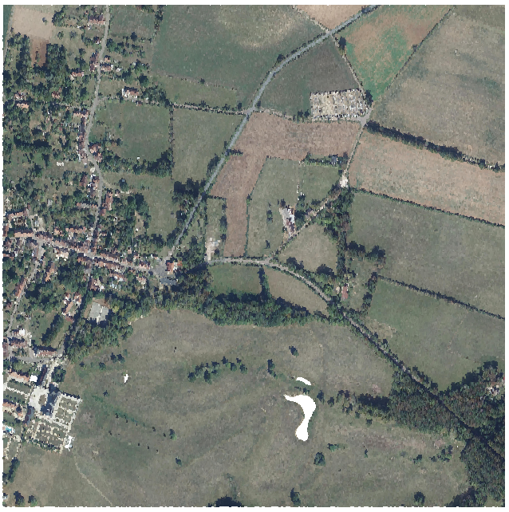
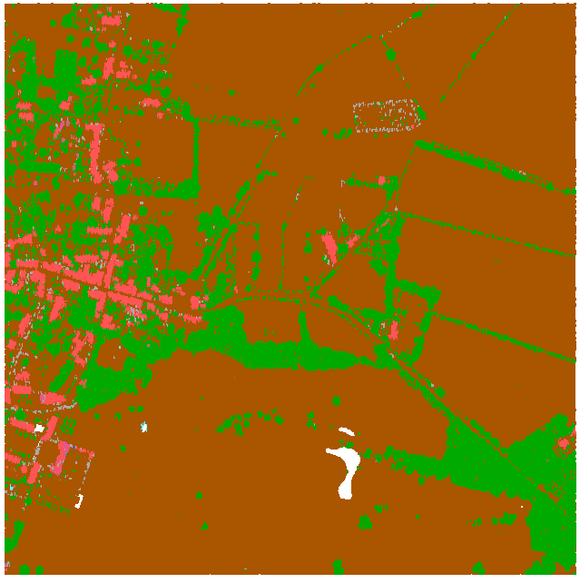

# Classification expédiée avec Myria3D

## Construction de l'image Docker

On clone le dépot en local 

```bash
git clone git@github.com:IGNF/myria3d.git
```

_Pour le moment il est nécessaire d'ajouter laspy comme dépendance pip dans environment.yml à la fin de ce fichier_

```yaml
- pip:
  - hydra-core==1.1.*
  - hydra-colorlog==1.1.*
  # --------- Documentation --------- #
  - myst_parser==0.17.*
  - sphinxnotes-mock==1.0.0b0 # still a beta
  - sphinx_paramlinks==0.5.*
  - ign-pdal-tools>=1.5.2
  - laspy
```

On construit l'image Docker (prend de 15 à 20 minutes)

```bash
cd myria3d
docker build . -t myria3d
```

## Création d'un environnement conda

Création d'un environnement conda

```bash
conda create -c conda-forge -n myria3d-workshop pdal gdal
conda activate myria3d-workshop
```

## Préparation d'une dalle LIDAR HD 

```bash
mkdir -p inference/inputs
cd inference/inputs
wget "https://storage.sbg.cloud.ovh.net/v1/AUTH_63234f509d6048bca3c9fd7928720ca1/ppk-lidar/LH/LHD_FXX_0721_6697_PTS_C_LAMB93_IGN69.copc.laz"
```

On supprime la classification avec la pipeline suivante. Créer le fichier `pipeline.json` avec le contenu suivant :

```json
[
    "LHD_FXX_0721_6697_PTS_C_LAMB93_IGN69.copc.laz",
    {
        "type": "filters.assign",
        "assignment": "Classification[:]=0"
    },
    "LHD_FXX_0721_6697_PTS_C_LAMB93_IGN69-NO-CLASSIF.copc.laz"
]
```

Executer la pipeline avec `pdal pipeline pipeline.json -v 8`. Vérifier dans QGIS la bonne suppression de la classification.


## Colorisation avec ign-pdal-tools

On installe la librairie ign-pdal-tools

```bash
pip install ign-pdal-tools laspy requests

```

On recopie le script [color.py](https://github.com/IGNF/ign-pdal-tools/blob/dev/pdaltools/color.py) depuis les sources de ign-pdal-tools et on créé un fichier color.py local.

On colorise ensuite la dalle précédente avec RVB + IRC.

```bash
python3 color.py --input LHD_FXX_0721_6697_PTS_C_LAMB93_IGN69-NO-CLASSIF.copc.laz --rvb --ir --output dalle.laz
```

On vérifie dans QGIS que la dalle a bien été colorisée.



## Inférence Myria3D sur la dalle colorisée

### Récupération de la configuration et du checkpoint les plus récents

On récupère depuis hugging face le checkpoint et la configuration hydra la plus récente et on les stocke dans le dossier `/inputs/`

```bash
wget "https://huggingface.co/IGNF/FRACTAL-LidarHD_7cl_randlanet/resolve/main/FRACTAL-LidarHD_7cl_randlanet-inference-Myria3DV3.8.yaml?download=true" -O FRACTAL-LidarHD_7cl_randlanet-inference-Myria3DV3.8.yaml
wget "https://huggingface.co/IGNF/FRACTAL-LidarHD_7cl_randlanet/resolve/main/FRACTAL-LidarHD_7cl_randlanet.ckpt?download=true" -O FRACTAL-LidarHD_7cl_randlanet.ckpt
```

### Lancement avec Docker

On se place dans le dossier `inference`

```bash
cd ..
```

On créé un dossier `outputs`

```bash
mkdir outputs
```

On lance l'inférence avec Docker

```bash
docker run \
-v ./inputs:/inputs \
-v ./outputs:/outputs \
--ipc=host \
--shm-size=2gb \
myria3d python run.py \
--config-path /inputs/ \
--config-name FRACTAL-LidarHD_7cl_randlanet-inference-Myria3DV3.8 \
task.task_name=predict \
predict.src_las=/inputs/dalle.laz \
predict.ckpt_path=/inputs/FRACTAL-LidarHD_7cl_randlanet.ckpt \
datamodule.epsg=2154 \
predict.output_dir=/outputs/ \
predict.interpolator.probas_to_save=[] \
predict.interpolator.predicted_classification_channel="Classification" \
predict.interpolator.entropy_channel=null
```

On visualise dans QGIS le résultat de cette inférence.


